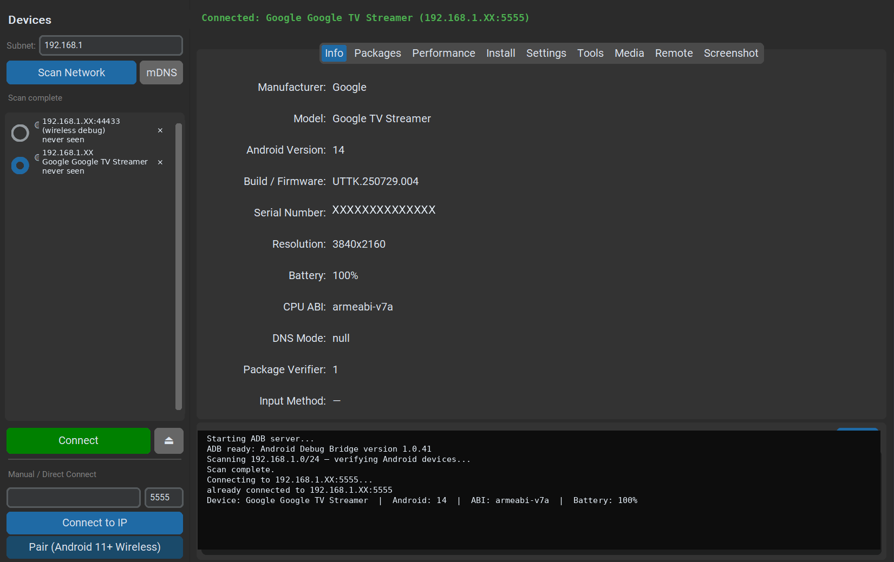
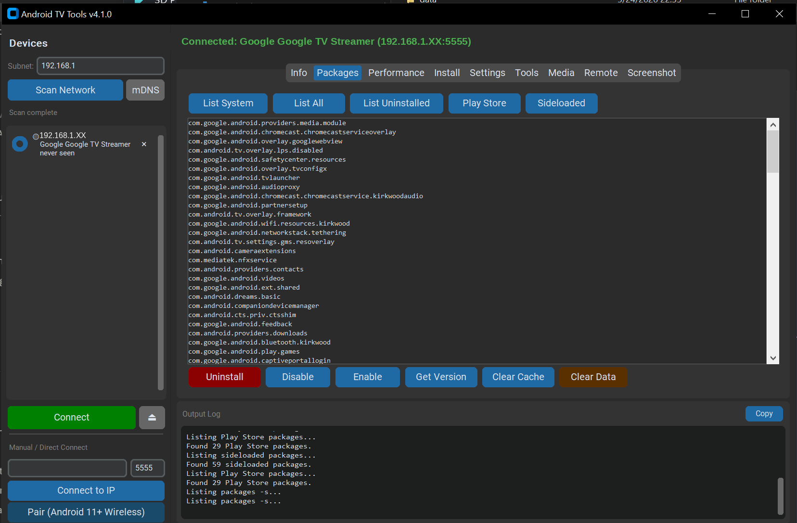
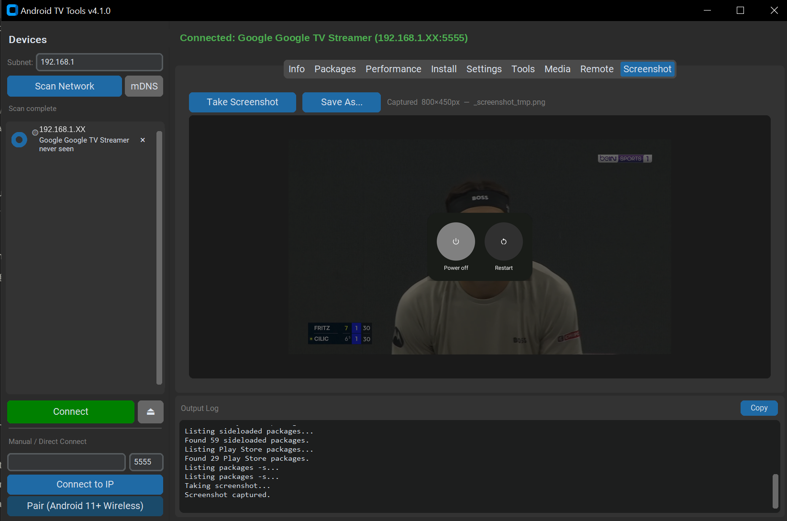

<p align="center">
  
</p>

# Android TV Desktop Toolkit

A Python/CustomTkinter desktop app for Windows and MacOS to manage Android TV and Google TV devices over ADB — no terminal required. Scan your network, manage packages, tune performance, sideload APKs, and capture screenshots from a single window.

**What you can do with it:**

- **Info** — see device details at a glance: brand, model, processor, DNS settings, input method, and more
- **Packages** — browse every app on your TV (including hidden system apps) and disable, enable, or uninstall them
- **Performance** — speed up your TV by optimizing app compilation, freezing background apps, and improving touch/remote response
- **Install** — sideload APKs directly to your TV with Play Protect bypass built in, and download, install, or launch Shizuku for advanced app management
- **Tools** — open system settings on your TV from your PC, send text input remotely, or disconnect ADB with one click
- **Screenshot** — capture screenshots from your TV and save them to your PC

<p align="center">
  
</p>

<p align="center">
  
</p>

<p align="center">
  
</p>

---

## Requirements

**If you're using the pre-built release:** nothing — ADB is bundled inside the app. Just download and run.

**If you're running from source or building yourself:** you need Python 3.10+, [uv](https://docs.astral.sh/uv/getting-started/installation/), and [ADB](https://developer.android.com/tools/releases/platform-tools) somewhere on your system (or in `PATH`).

**Enable ADB on your Android TV device:**
Settings → Device Preferences → About → click **Build** 7× to unlock Developer Options, then enable **Network debugging** (ADB over Wi-Fi) in Developer Options.

---

## Install

**Pre-built Windows exe or macOS app**

- For Windows, download the latest release from the [Releases](../../releases) page, unzip, and run `Android TV Desktop Toolkit.exe`.

- For MacoS, download `AndroidTVDesktopToolkit.dmg` from the [Releases](../../releases) page, open it, and drag the app to your Applications folder.

ADB is bundled — no separate install needed.

---

## Running from source

```powershell
uv sync
uv run android_tv_tools.py
```

---

## Building the exe

Requires Python 3.12 or 3.13 (PyInstaller does not yet fully support 3.14):

```powershell
.\scripts\build.ps1
```

Output lands in `dist/Android TV Desktop Toolkit/`. Zip that folder for distribution.

---

## Attribution

This project is an unaffiliated simple GUI reimplementation of [**Android TV Tools v4.0** by **bernarbernuli**](https://xdaforums.com/t/tool-all-in-one-tool-for-windows-android-tv-tools-v4.4648239/).

The original is a Windows batch-script compiled to an executable. This project was written from scratch in Python using CustomTkinter; no original source code was copied. All ADB commands (`adb shell pm`, `adb install`, etc.) are standard Android Debug Bridge invocations documented by Google.

Many thanks to bernarbernuli for sharing the original tool freely with the community — it defined the feature set implemented here.

---

## License

See [LICENSE](LICENSE).

*License applies to this project's source code only. ADB is a Google product under its own license. The original Android TV Tools by bernarbernuli is a separate work under its own terms.*
